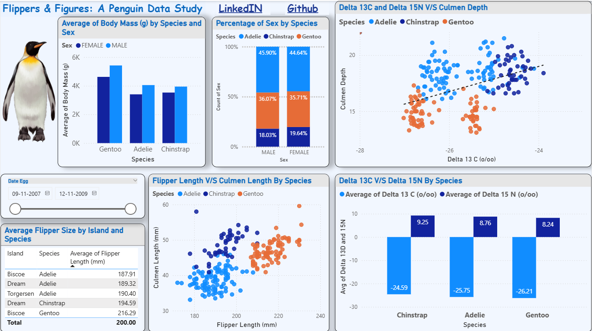

# 🐧 Flippers & Figures: A Penguin Data Study (Power BI)

This Power BI project explores the [Palmer Penguins dataset]([https://allisonhorst.github.io/palmerpenguins/](https://www.kaggle.com/datasets/parulpandey/palmer-archipelago-antarctica-penguin-data/data)) to reveal ecological and biological insights across species, using visual analytics and interactive storytelling.

🔍 **Key Insights from the Dashboard**
- **Gentoo penguins** have the longest flippers on average, especially those from Biscoe Island.
- **Male Adelie and Gentoo penguins** show lower δ13C levels, suggesting variation in dietary sources.
- **Chinstrap penguins** have a relatively balanced sex distribution, unlike other species.

🖥️ **Live Report:**  
🔗 [Click to view on Power BI Community](https://community.fabric.microsoft.com/t5/Data-Stories-Gallery/Flippers-and-Figures-A-Penguin-Data-Study/m-p/4767435)

---

📦 **Tools Used**
- Power BI Desktop  
- DAX Measures  
- Custom Visual Formatting  
- Scatter Plots, Bar Charts, Cards, and Slicers

